Behavior Driven Development (BDD) là một phần mở rộng của TDD. Giống như
ở TDD, trong BDD chúng ta cũng viết các bài test trước và sau đó mới
code ứng dụng để vượt qua những bài test đó. Sự khác biệt chính của BDD
so với TDD chính là thay vì tập trung vào phát triển phần mềm theo hướng
kiểm thử, BDD lại tập trung vào phát triển phần mềm theo hướng hành vi.
Quá trình này dựa vào requirement (yêu cầu) các kịch bản test mới được
viết trước dưới dạng ngôn ngữ tự nhiên và dễ hiểu nhất.

Nói cách khác: Thay vì tập trung viết Test Unit bằng các test functions
(code) như ở phương pháp TDD, thì thay vào đó ta tập trung vào viết Test
Scenario ( sử dụng ngôn ngữ tự nhiên ) theo phương pháp BDD

Ưu điểm của phương pháp BDD:

-   Các bài test hay các test case sẽ được viết bằng ngữ pháp tiếng Anh
    và mô tả rất đơn giản

-   Các bài test được xem như là hành vi của ứng dụng dựa trên những nhu
    cầu thực tế của người dùng với ứng dụng đó

**BDD trong Laravel**

Thiết kế ứng dụng theo phương pháp BDD bằng behat trong laravel

1.  Tạo một project laravel 5.8

composer create-project \--prefer-dist laravel/laravel BDD_Todolist
\"5.8.\*\"

2.  Cài đặt các dependencies cần thiết

> composer require behat/behat behat/mink behat/mink-extension
> laracasts/behat-laravel-extension --dev

3.  Chạy vendor/bin/behat --init khởi tạo class FeatureContext

Giờ ta có file features\\bootstrap\\FeatureContext.php, extends class
với MinkContext và implements Context, SnippetAcceptingContext

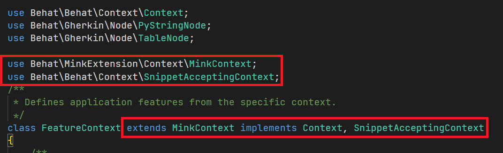{width="6.043478783902012in"
height="1.84457239720035in"}

Vì class FeatureContext đã kế thừa MinkContext ( đồng nghĩa với việc
chúng ta có một số hàm viết sẵn để kiểm thử theo Test Scenario

Để xem tất cả những Scenario được viết sẵn, ta gõ lệnh :
vendor/bin/behat -dl

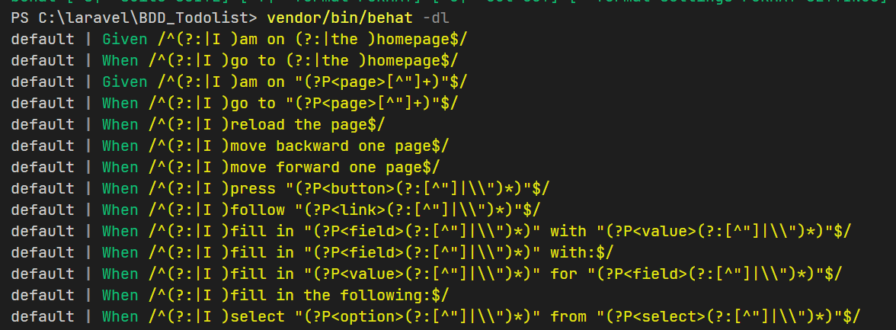{width="6.5in"
height="2.3930555555555557in"}

Tạo file behat.yml chứa config

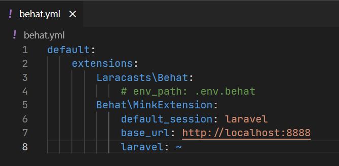{width="6.5in"
height="3.1868055555555554in"}

Chúng ta sẽ tiến hành viết + sử dụng những Scenario được viết sẵn trên
để thực hiện việc phát triển theo Test Scenario (BDD)

Chạy lệnh cp .env.example .env.behat để tạo file enviroment cho behat

Chạy php artisan key:generate

Vào file .env copy APP_KEY

Sang file .env.behat paste APP_KEY đó vào

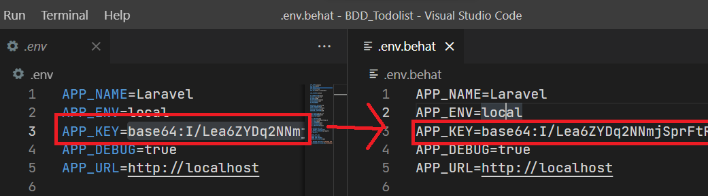{width="6.495833333333334in"
height="1.8090277777777777in"}

Tạo file features\\app.feature

Sau đó ta tiến hành viết Test Scenario

File .feature của chúng ta gồm 2 phần , phần Feature dùng để đặc tả mục
tiêu bài test

Phần Scenario chứa các Test Scenario giả định

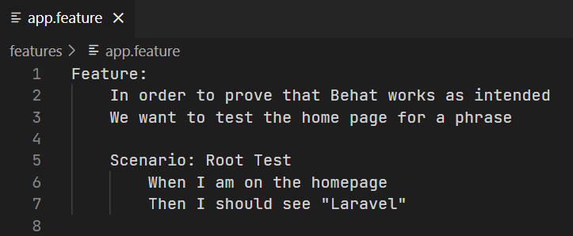{width="6.5in"
height="2.6791666666666667in"}

Để chạy Test Scenario giả định ở trên , ta gõ lệnh: vendor/bin/behat

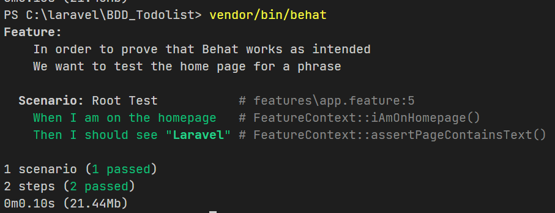{width="6.5in" height="2.49375in"}

Như ta thấy 2 test đã pass

Nhưng làm sao không viết unit test nhưng behat vẫn thực hiện được test
scenario cho chúng ta?

Là tại vì ở phần FeatureContext phía trên, ta đã kế thừa lại class
MinkContext chứa sẵn các unit test viết dựa trên scenario phổ biến

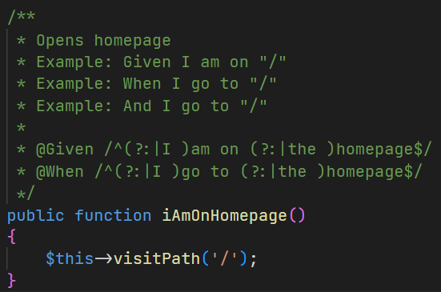{width="5.740384951881015in"
height="3.802613735783027in"}

Nhưng tại sao lại chạy function unit test này? , chính là vì behat đã tự
parse file app.feature của chúng ta, dựa trên test scenario chúng ta
viết mà quyết định xem nên chạy function unit test nào

Ví dụ như hàm trên sẽ được khích hoạt khi scenario của chúng ta là một
trong những trường hợp sau

"When I am on the homepage"

"Given I am on the homepage"

"When am on homepage"

"Given am on homepage"

Chỉ cần câu diễn tả test scenario của chúng ta hợp với regex của behat ,
behat sẽ tự gọi đến unit test của scenario đó

Vậy nếu ta muốn tự viết unit test riêng của mình , không sử dụng đến
unit test được viết sẵn?

Chúng ta sẽ thử tự implement test scenario của chính mình

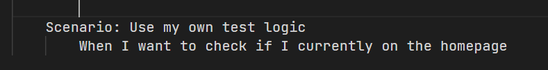{width="6.5in"
height="0.8319444444444445in"}

ta gõ lệnh: vendor/bin/behat

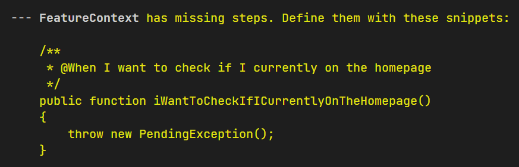{width="6.5in"
height="2.0993055555555555in"}

Test scenario được chạy , nhưng vì unit test chưa được implement nên
behat sẽ báo lỗi thiếu steps

Ta copy snippets trên và paste vào
features\\bootstrap\\FeatureContext.php

Bởi vì behat không đi kèm với các phương thức dùng để thực hiện
assertions

Ta sẽ import TestCase làm thư viện để thực hiện assertions

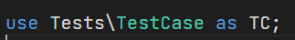{width="3.3650524934383204in"
height="0.45839676290463693in"}

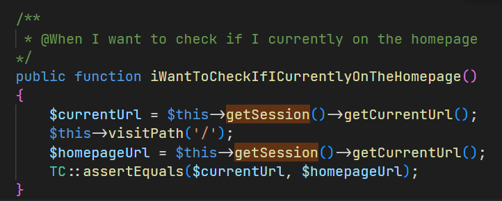{width="6.5in"
height="2.6104166666666666in"}

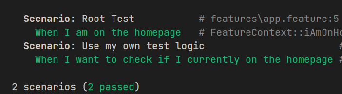{width="6.5in"
height="1.7868055555555555in"}

Kết hợp các test scenarios có sẵn và custom , ta tiến hành xây dựng ứng
dụng tương tự như TCC nhưng lần này ta sẽ thiết kế test scenerios trước
, ưu tiên sử dụng những scenerios có sẵn, nếu không có thì ta sẽ tự tạo
scenerios và unit test custom riêng. Từ đó implement tất cả các
requirements bắt đầu từ Behavior (Behavior Driven Development - BDD)

Tương tự như TCC thì ta sẽ build một Todolist App bằng phương pháp BDD

Ví dụ giữa TCC chuyển đổi & so sánh với BDD

TCC:

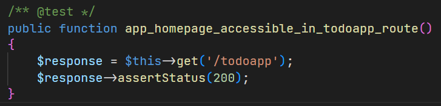{width="6.5in"
height="1.573611111111111in"}

BDD:

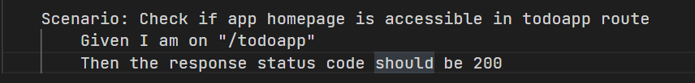{width="6.5in"
height="0.7819444444444444in"}

Khi chạy test BDD ở trên ta thấy báo lỗi , lỗi này tương tự như khi ta
thiết kế ứng dụng với TCC , chỉ khác ở chỗ ở đây là Behavior Driven

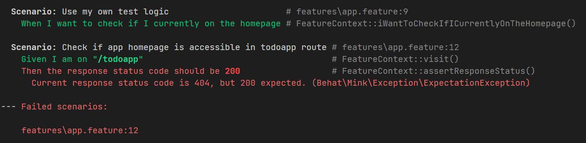{width="6.5in"
height="1.586111111111111in"}

Và từ bước này trở đi thì giống y hết cách chúng ta phát triển phần mềm
theo phương pháp TCC, Ta fix lỗi trên bằng cách thêm route todoapp -\>
làm cho route accessible

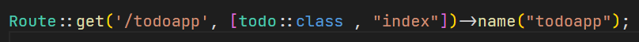{width="6.5in"
height="0.4340277777777778in"}

Và chạy lại test case

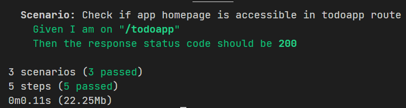{width="6.5in" height="1.7375in"}

Tiếp tục quy trình này cho đến khi implement hết tất cả các requirement
